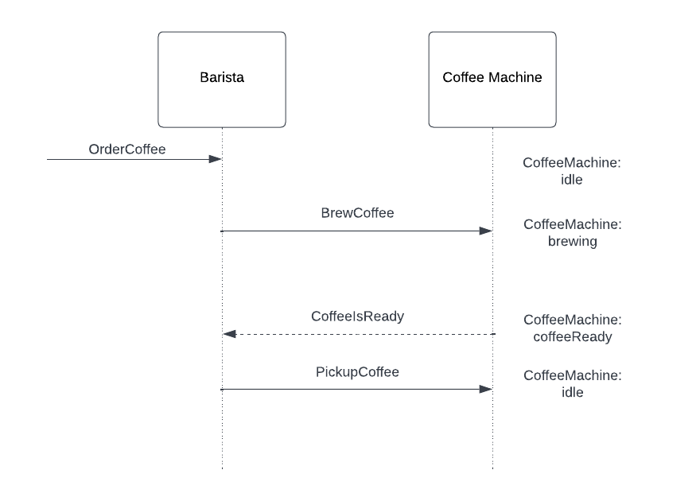

# Exercise - Interaction Patterns (Request-Response)

## Objective

In this exercise, you will implement a request-response pattern between the `Barista` and `CoffeeMachine` actors.\
The `CoffeeMachine` will process one coffee at a time and notify the `Barista` when the coffee is ready.



- The `Barista` will send a coffee order to the `CoffeeMachine` and handle its response.
- The `CoffeeMachine` will notify the `Barista` once the coffee is brewed.

## Instructions

1. **Edit `CoffeeMachine.java`**:
    - Implement the logic for sending a response to the **Barista** when a coffee is ready.

2. **Edit `Barista.java`**:
    - Upon receiving an `OrderCoffee`, send a `BrewCoffee` message to the `CoffeeMachine`.
    - Handle the `CoffeeIsReady` response from the `CoffeeMachine`:
        - Log the pickup action with the following line, replacing `[coffee]` with the coffee received:

          ```java
          getContext().getLog().info("Barista: Picking up {}", [coffee]);
          ```

        - Send a `PickupCoffee` message to the `CoffeeMachine` to reset its state.

3. **Run the tests**:
    - Validate your implementation by running the unit tests:

      ```bash
      mvn clean test
      ```

4. **Hint**:
    - If you need to review the completed implementation, navigate to:
      `akka-interaction-patterns-for-java/solutions/001_request_response_pattern`

## Reflection

- Consider how the `Barista` handles responses from the `CoffeeMachine`.
- Observe how this interaction pattern ensures state consistency in the `CoffeeMachine`.
