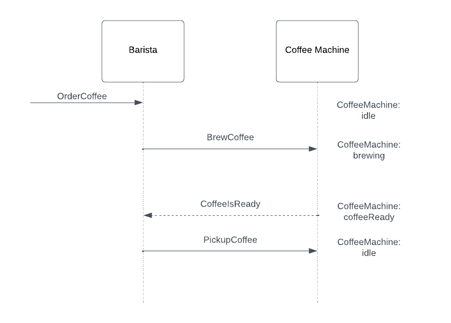

# Exercise - Adapted Response

## Objective

In this exercise, you will implement the adapted response pattern between the `Barista` and `CoffeeMachine` actors.\
`CoffeeMachine` will no longer depend on the `Barista`'s protocol to notify when a coffee is ready.\
Instead, the **Barista** will use a message adapter to handle the response.



### Key Changes

- The `CoffeeReady` message type is now part of the `CoffeeMachine`'s protocol, not the `Barista`'s.
- The `Barista` will adapt the response to its own protocol using a message adapter.

## Instructions

1. **Edit `Barista.java`**:
    - Implement a message adapter to handle responses from the `CoffeeMachine`.
    - Use the following log line where you process the coffee response, replacing `[coffee]` with the actual coffee
      received:

      ```java
      getContext().getLog().info("Barista: Picking up {}", [coffee]);
      ```

2. **Edit `CoffeeMachine.java`**:
    - Update the implementation so that the `CoffeeMachine` sends a `CoffeeReady` message when the coffee is brewed.

3. **Run the Tests**:
    - Validate your implementation by running the unit tests:

      ```bash
      mvn clean test
      ```

4. **Hint**:
    - If you need to review the completed implementation, navigate to:
      `akka-interaction-patterns-for-java/solutions/002_adapted_response_pattern`

## Reflection

- How does using a message adapter reduce coupling between the `CoffeeMachine` and `Barista`?
- Consider how this approach improves flexibility in actor communication.
